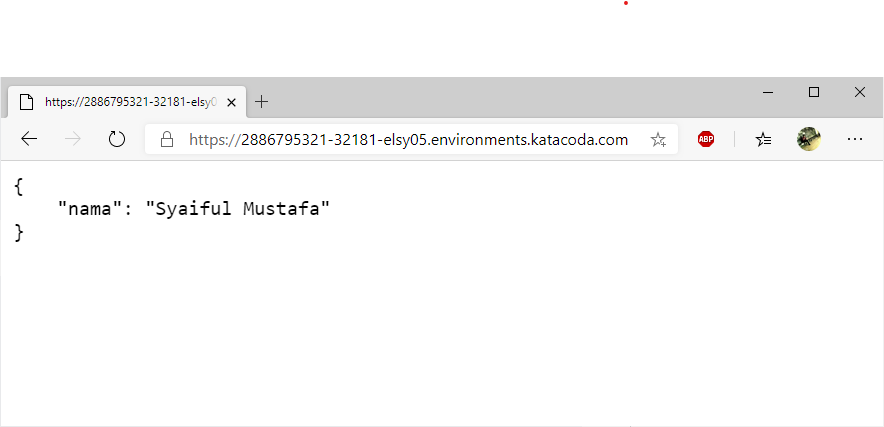

# Membuat Image
Seperti pada pertemuan minggu-08, membuat sebuah image menggunakan Python Flask dengan nama
`sfmusta/hehe-flask:v1`
- Dockerfile
```dockerfile
#https://medium.com/@mtngt/docker-flask-a-simple-tutorial-bbcb2f4110b5

FROM python:2.7
COPY . /app
WORKDIR /app
RUN pip install -r requirements.txt
ENTRYPOINT ["python"]
CMD ["app.py"]

```
- app.py
```python
# app.py - a minimal flask api using flask_restful
from flask import Flask
from flask_restful import Resource, Api

app = Flask(__name__)
api = Api(app)

class HelloWorld(Resource):
    def get(self):
        return {'nama': 'Syaiful Mustafa'}

api.add_resource(HelloWorld, '/')

if __name__ == '__main__':
    app.run(debug=True, host='0.0.0.0')

```
- requirements.txt
```
flask
flask_restful
```

# Menjalankan di Kubernetes
1. Membuat deployment untuk image hehe-flask
```bash
$ kubectl create deployment hehe-flask --image=sfmusta/hehe-flask:v1
deployment.apps/hehe-flask created
```
2. Membuat service untuk meng-expose port 5000 image hehe-flask
```bash
$ kubectl expose deployment hehe-flask --type=LoadBalancer --port=5000
service/hehe-flask exposed
```
3.  Melihat Service yang berjalan
```bash
$ kubectl get services
NAME         TYPE           CLUSTER-IP     EXTERNAL-IP   PORT(S)          AGE
hehe-flask   LoadBalancer   10.96.92.134   <pending>     5000:32181/TCP   61s
kubernetes   ClusterIP      10.96.0.1      <none>        443/TCP          54m
```
4. Terlihat bahwa port 5000 di expose ke port 32181
```bash
$ kubectl get services
NAME         TYPE           CLUSTER-IP     EXTERNAL-IP   PORT(S)          AGE
hehe-flask   LoadBalancer   10.96.92.134   <pending>     5000:32181/TCP   61s
kubernetes   ClusterIP      10.96.0.1      <none>        443/TCP          54m
```
5. Jalankan melalui browser
